[Google Scholar](https://scholar.google.com/citations?user=n778aCsAAAAJ&hl=en)

&#42; Indicates a primary author, in addition to the first-listed author.

<nav class="publication-years" aria-label="Publication years"><a href="#year-2026">2026</a><a href="#year-2025">2025</a><a href="#year-2024">2024</a><a href="#year-2023">2023</a><a href="#year-2022">2022</a><a href="#year-2020">2020</a><a href="#year-2019">2019</a></nav>

## 2026 {#year-2026}

<article class="publication" id="algorithms">
<figure class="publication-figure">
<a href="https://raw.githubusercontent.com/mlresearch/v306/main/assets/wittig26a/wittig26a.pdf#page=57" aria-label="View Which Algorithms Can Graph Neural Networks Learn?">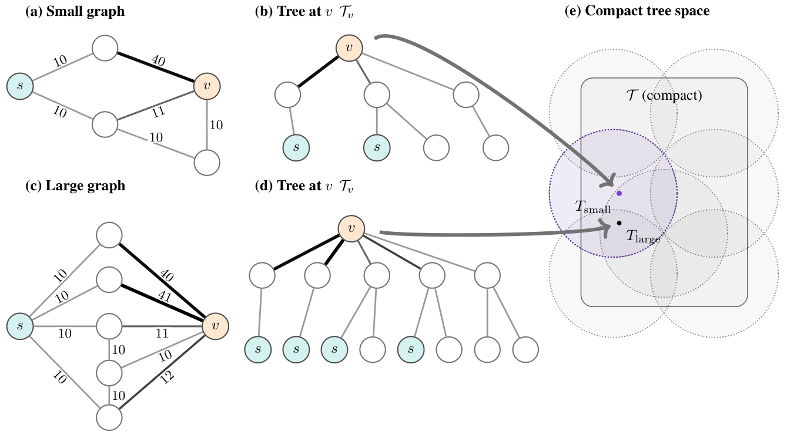</a>
<figcaption>Fig. 5 · Computation trees &amp; generalization</figcaption>
</figure>

<h3><a href="https://proceedings.mlr.press/v306/wittig26a.html">Which Algorithms Can Graph Neural Networks Learn?</a></h3>

Solveig Wittig&#42;, Antonis Vasileiou&#42;, <strong>Robert R. Nerem</strong>&#42;, Timo Stoll, Floris Geerts, Yusu Wang, Christopher Morris.

ICML 2026 · Proceedings of Machine Learning Research 306, 135232–135307 Spotlight Oral

<a href="https://proceedings.mlr.press/v306/wittig26a.html">Paper</a> <a href="https://raw.githubusercontent.com/mlresearch/v306/main/assets/wittig26a/wittig26a.pdf">PDF</a> <a href="https://arxiv.org/abs/2602.13106">arXiv</a>

</article>

<article class="publication" id="shortest">
<figure class="publication-figure">
<a href="https://raw.githubusercontent.com/mlresearch/v336/main/assets/nerem26a/nerem26a.pdf#page=4" aria-label="View Graph Neural Networks Extrapolate Out-of-Distribution for Shortest Paths">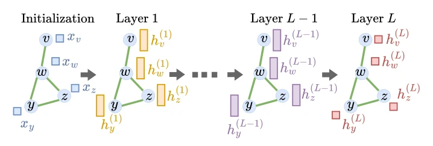</a>
<figcaption>Fig. 1 · GNN layers</figcaption>
</figure>

<h3><a href="https://proceedings.mlr.press/v336/nerem26a.html">Graph Neural Networks Extrapolate Out-of-Distribution for Shortest Paths</a></h3>

<strong>Robert R. Nerem</strong>, Samantha Chen&#42;, Sanjoy Dasgupta, Yusu Wang.

COLT 2026 · Proceedings of Machine Learning Research 336, 5273–5331 

<a href="https://proceedings.mlr.press/v336/nerem26a.html">Paper</a> <a href="https://raw.githubusercontent.com/mlresearch/v336/main/assets/nerem26a/nerem26a.pdf">PDF</a> <a href="https://arxiv.org/abs/2503.19173">arXiv</a>

</article>

<article class="publication" id="position">
<figure class="publication-figure">
<a href="https://openreview.net/pdf/84ef486207f242957c176f074962075b4a9bc89e.pdf" aria-label="View Neural Algorithmic Reasoning Must Explain When Neuralization Adds Value">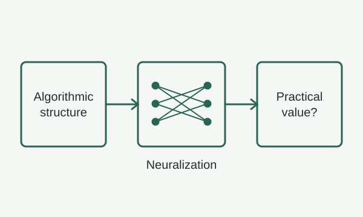</a>
<figcaption>Conceptual schematic</figcaption>
</figure>

<h3><a href="https://openreview.net/forum?id=A4FI5tZRT4">Neural Algorithmic Reasoning Must Explain When Neuralization Adds Value</a></h3>

Yu He, <strong>Robert R. Nerem</strong>, Timo Stoll, Semih Cantürk, Dobrik Georgiev, Chendi Qian, Solveig Wittig, Floris Geerts, Stefanie Jegelka, Ellen Vitercik, Yusu Wang, Nikolaos Karalias, Christopher Morris.

3rd AI for Math Workshop · ICML 2026 

<a href="https://openreview.net/forum?id=A4FI5tZRT4">Paper</a> <a href="https://openreview.net/pdf/84ef486207f242957c176f074962075b4a9bc89e.pdf">PDF</a>

</article>

## 2025 {#year-2025}

<article class="publication" id="permutations">
<figure class="publication-figure">
<a href="https://papers.nips.cc/paper_files/paper/2025/file/9840235bd522f0f067f306ddfd6d1ca1-Paper-Conference.pdf#page=21" aria-label="View Differentiable Extensions with Rounding Guarantees for Combinatorial Optimization over Permutations">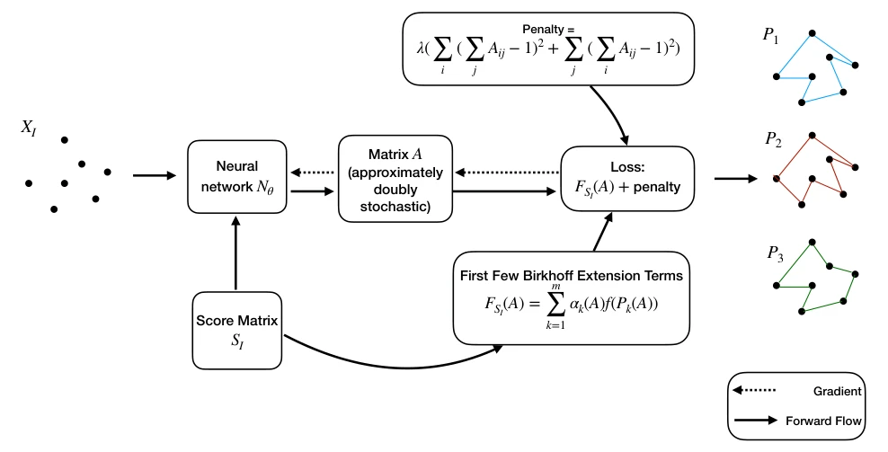</a>
<figcaption>Fig. 1 · Optimization pipeline</figcaption>
</figure>

<h3><a href="https://papers.nips.cc/paper_files/paper/2025/hash/9840235bd522f0f067f306ddfd6d1ca1-Abstract-Conference.html">Differentiable Extensions with Rounding Guarantees for Combinatorial Optimization over Permutations</a></h3>

<strong>Robert R. Nerem</strong>, Zhishang Luo, Akbar Rafiey, Yusu Wang.

NeurIPS 2025 · Advances in Neural Information Processing Systems 38 

<a href="https://papers.nips.cc/paper_files/paper/2025/hash/9840235bd522f0f067f306ddfd6d1ca1-Abstract-Conference.html">Paper</a> <a href="https://papers.nips.cc/paper_files/paper/2025/file/9840235bd522f0f067f306ddfd6d1ca1-Paper-Conference.pdf">PDF</a> <a href="https://arxiv.org/abs/2411.10707">arXiv</a>

</article>

## 2024 {#year-2024}

<article class="publication" id="steiner">
<figure class="publication-figure">
<a href="https://arxiv.org/pdf/2312.10589#page=3" aria-label="View NN-Steiner: A Mixed Neural-Algorithmic Approach for the Rectilinear Steiner Minimum Tree Problem">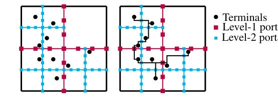</a>
<figcaption>Fig. 2 · Quadtree &amp; Steiner tree</figcaption>
</figure>

<h3><a href="https://doi.org/10.1609/aaai.v38i12.29200">NN-Steiner: A Mixed Neural-Algorithmic Approach for the Rectilinear Steiner Minimum Tree Problem</a></h3>

Andrew B. Kahng, <strong>Robert R. Nerem</strong>, Yusu Wang, Chien-Yi Yang.

AAAI 2024 · Proceedings of the AAAI Conference on Artificial Intelligence 38(12), 13022–13030 

<a href="https://doi.org/10.1609/aaai.v38i12.29200">Paper</a> <a href="https://arxiv.org/pdf/2312.10589">PDF</a>

</article>

## 2023 {#year-2023}

<article class="publication" id="bitcoin">
<figure class="publication-figure">
<a href="https://arxiv.org/pdf/2110.00878#page=8" aria-label="View Conditions for Advantageous Quantum Bitcoin Mining">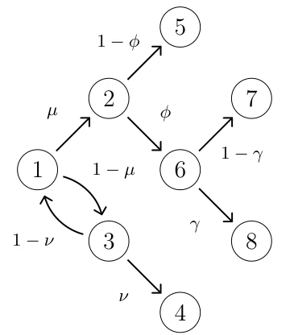</a>
<figcaption>Fig. 1 · State-transition graph</figcaption>
</figure>

<h3><a href="https://doi.org/10.1016/j.bcra.2023.100141">Conditions for Advantageous Quantum Bitcoin Mining</a></h3>

<strong>Robert R. Nerem</strong>, Daya R. Gaur.

Blockchain: Research and Applications 4(3), 100141 

<a href="https://doi.org/10.1016/j.bcra.2023.100141">Paper</a> <a href="https://arxiv.org/pdf/2110.00878">PDF</a>

</article>

## 2022 {#year-2022}

<article class="publication" id="quantum">
<figure class="publication-figure">
<a href="https://arxiv.org/pdf/2111.10485" aria-label="View Tight Bound for Estimating Expectation Values from a System of Linear Equations">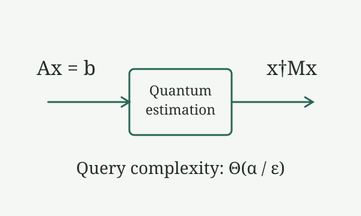</a>
<figcaption>Conceptual schematic</figcaption>
</figure>

<h3><a href="https://doi.org/10.1103/PhysRevResearch.4.023237">Tight Bound for Estimating Expectation Values from a System of Linear Equations</a></h3>

Abhijeet Alase, <strong>Robert R. Nerem</strong>, Mohsen Bagherimehrab, Peter Høyer, Barry C. Sanders.

Physical Review Research 4(2), 023237 

<a href="https://doi.org/10.1103/PhysRevResearch.4.023237">Paper</a> <a href="https://arxiv.org/pdf/2111.10485">PDF</a>

</article>

<article class="publication" id="genetic">
<figure class="publication-figure">
<a href="https://arxiv.org/pdf/2107.12352#page=2" aria-label="View Genetic Networks Encode Secrets of Their Past">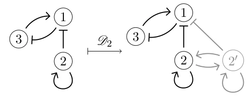</a>
<figcaption>Fig. 1 · Vertex duplication</figcaption>
</figure>

<h3><a href="https://doi.org/10.1016/j.jtbi.2022.111092">Genetic Networks Encode Secrets of Their Past</a></h3>

Peter Crawford-Kahrl&#42;, <strong>Robert R. Nerem</strong>&#42;, Bree Cummins, Tomas Gedeon.

Journal of Theoretical Biology 541, 111092 

<a href="https://doi.org/10.1016/j.jtbi.2022.111092">Paper</a> <a href="https://arxiv.org/pdf/2107.12352">PDF</a>

</article>

<article class="publication" id="thesis">
<figure class="publication-figure">
<a href="https://scholar.google.com/citations?view_op=view_citation&amp;hl=en&amp;user=n778aCsAAAAJ&amp;citation_for_view=n778aCsAAAAJ:W7OEmFMy1HYC" aria-label="View Optimization of Quantum Algorithms for Applications">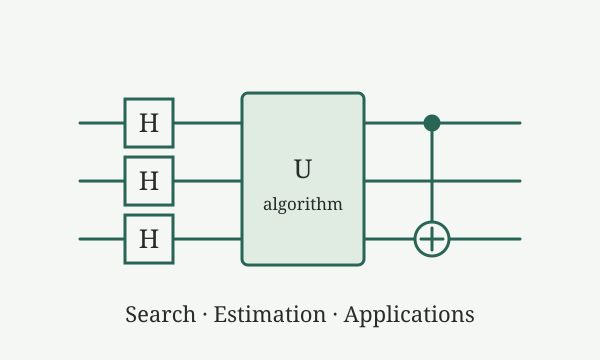</a>
<figcaption>Conceptual schematic</figcaption>
</figure>

<h3><a href="https://scholar.google.com/citations?view_op=view_citation&amp;hl=en&amp;user=n778aCsAAAAJ&amp;citation_for_view=n778aCsAAAAJ:W7OEmFMy1HYC">Optimization of Quantum Algorithms for Applications</a></h3>

<strong>Robert Riley Nerem</strong>.

Master’s thesis · University of Calgary 

<a href="https://scholar.google.com/citations?view_op=view_citation&amp;hl=en&amp;user=n778aCsAAAAJ&amp;citation_for_view=n778aCsAAAAJ:W7OEmFMy1HYC">Record</a>

</article>

## 2020 {#year-2020}

<article class="publication" id="detector">
<figure class="publication-figure">
<a href="https://doi.org/10.1364/OPTICA.400751" aria-label="View Superconducting Nanowire Single-Photon Detectors with 98% System Detection Efficiency at 1550 nm">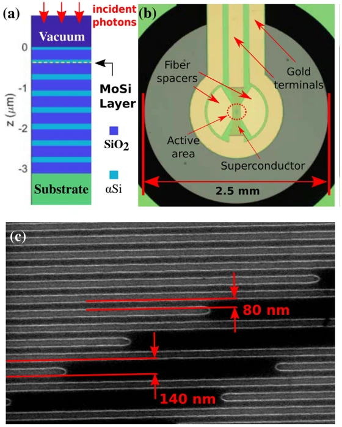</a>
<figcaption>Fig. 2 · Detector architecture</figcaption>
</figure>

<h3><a href="https://doi.org/10.1364/OPTICA.400751">Superconducting Nanowire Single-Photon Detectors with 98% System Detection Efficiency at 1550 nm</a></h3>

Dileep V. Reddy, <strong>Robert R. Nerem</strong>, Sae Woo Nam, Richard P. Mirin, Varun B. Verma.

Optica 7(12), 1649–1653 

<a href="https://doi.org/10.1364/OPTICA.400751">Paper</a>

</article>

<article class="publication" id="malaria">
<figure class="publication-figure">
<a href="https://doi.org/10.1126/science.aba4357" aria-label="View An Intrinsic Oscillator Drives the Blood Stage Cycle of the Malaria Parasite Plasmodium falciparum">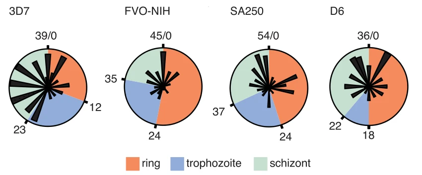</a>
<figcaption>Fig. 2 · Gene-expression phases</figcaption>
</figure>

<h3><a href="https://doi.org/10.1126/science.aba4357">An Intrinsic Oscillator Drives the Blood Stage Cycle of the Malaria Parasite Plasmodium falciparum</a></h3>

Lauren M. Smith, Francis C. Motta, Garima Chopra, J. Kathleen Moch, <strong>Robert R. Nerem</strong>, Bree Cummins, Kimberly E. Roche, Christina M. Kelliher, Adam R. Leman, John Harer, Tomas Gedeon, Norman C. Waters, Steven B. Haase.

Science 368(6492), 754–759 

<a href="https://doi.org/10.1126/science.aba4357">Paper</a>

</article>

<article class="publication" id="pickup">
<figure class="publication-figure">
<a href="https://doi.org/10.1119/1.5145417" aria-label="View Charged Particle Pickup Tube Detector Used in Experimental Applications and Classroom Demonstrations">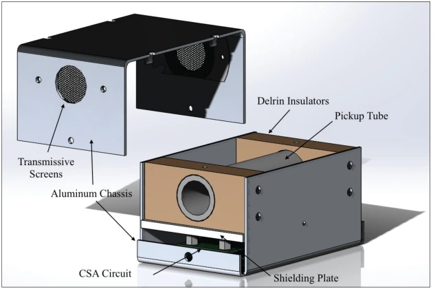</a>
<figcaption>Fig. 1 · Detector model</figcaption>
</figure>

<h3><a href="https://doi.org/10.1119/1.5145417">Charged Particle Pickup Tube Detector Used in Experimental Applications and Classroom Demonstrations</a></h3>

<strong>Robert R. Nerem</strong>, David James.

The Physics Teacher 58(3), 200–203 

<a href="https://doi.org/10.1119/1.5145417">Paper</a>

</article>

<article class="publication" id="extremal">
<figure class="publication-figure">
<a href="https://doi.org/10.1007/s00285-020-01471-4" aria-label="View Using Extremal Events to Characterize Noisy Time Series">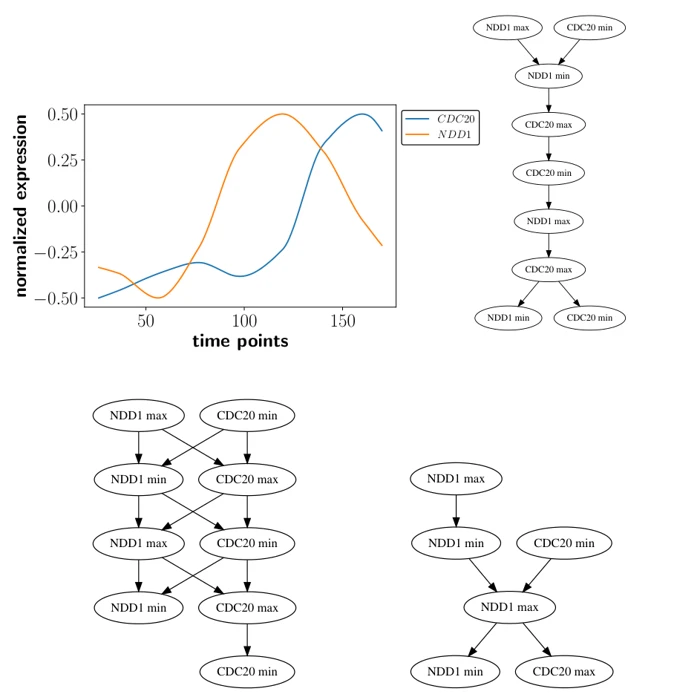</a>
<figcaption>Fig. 2 · Time series &amp; partial orders</figcaption>
</figure>

<h3><a href="https://doi.org/10.1007/s00285-020-01471-4">Using Extremal Events to Characterize Noisy Time Series</a></h3>

Eric Berry, Bree Cummins, <strong>Robert R. Nerem</strong>, Lauren M. Smith, Steven B. Haase, Tomas Gedeon.

Journal of Mathematical Biology 80, 1523–1557 

<a href="https://doi.org/10.1007/s00285-020-01471-4">Paper</a>

</article>

## 2019 {#year-2019}

<article class="publication" id="poset">
<figure class="publication-figure">
<a href="https://arxiv.org/pdf/1910.14638#page=11" aria-label="View A Poset Metric from the Directed Maximum Common Edge Subgraph">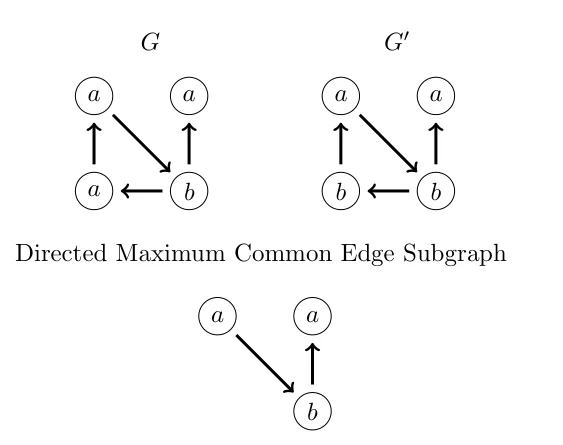</a>
<figcaption>Fig. 4 · Common edge subgraph</figcaption>
</figure>

<h3><a href="https://arxiv.org/abs/1910.14638">A Poset Metric from the Directed Maximum Common Edge Subgraph</a></h3>

<strong>Robert R. Nerem</strong>, Peter Crawford-Kahrl, Bree Cummins, Tomas Gedeon.

Preprint · arXiv:1910.14638 (revised 2020) 

<a href="https://arxiv.org/abs/1910.14638">Paper</a> <a href="https://arxiv.org/pdf/1910.14638">PDF</a>

</article>

<article class="publication" id="cleo">
<figure class="publication-figure">
<a href="https://doi.org/10.1364/CLEO_QELS.2019.FF1A.3" aria-label="View Exceeding 95% System Efficiency Within the Telecom C-Band in Superconducting Nanowire Single Photon Detectors">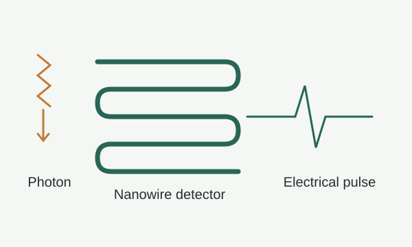</a>
<figcaption>Conceptual schematic</figcaption>
</figure>

<h3><a href="https://doi.org/10.1364/CLEO_QELS.2019.FF1A.3">Exceeding 95% System Efficiency Within the Telecom C-Band in Superconducting Nanowire Single Photon Detectors</a></h3>

Dileep V. Reddy, <strong>Robert R. Nerem</strong>, Adriana E. Lita, Sae Woo Nam, Richard P. Mirin, Varun B. Verma.

CLEO: QELS—Fundamental Science · FF1A.3 

<a href="https://doi.org/10.1364/CLEO_QELS.2019.FF1A.3">Paper</a>

</article>
